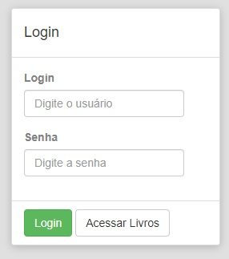

# BIBLIOTECA
Sistema de gerenciamento de biblioteca, desenvolvido em PHP com orientação a objeto.

# INSTALAÇÃO E CONFIGURAÇÃO
Caso o XAMPP tenha sido instalado de forma padrão, clonar o projeto para a pasta `C:\xampp\htdocs`.

## BANCO DE DADOS
* Abrir o **PHPMYADMIN** e criar o banco de dados "biblioteca";
* Importar o arquivo `biblioteca.sql` que encontra-se na raiz do projeto;
* Alterar o nome do arquivo APP\Config\\`livro.ini.example` para APP\Config\\`livro.ini` e inserir usuário e senha de acesso ao banco nos campos indicados;

> Senhas da tabela `usuario` DEVEM ser salvas no formato MD5.

> Quaisquer alterações/inserções que forem necessárias nas tabelas `usuario`, `tipo_locatario`, `tipo_disponivel`, `tipo_classificacao`, devem ser feitas diretamente no banco de dados.

## BACKUP DO BANCO DE DADOS PARA UM E-MAIL
Existe a funcionalidade de fazer backup dos dados onde salva-se localmente em `APP\Database\` e também envia para um e-mail pré-configurado. Para o correto funcionamento, siga a etapa abaixo:
* Alterar o nome do arquivo `config.php.example` para `config.php` e inserir o servidor smtp, email e senha nos campos indicados;

# O SISTEMA

## TELA INICIAL
Caso a configuração tenha sido feita de forma correta e não tenha nenhum erro, ao acessar a tela inicial será essa:

O botão `Acessar Livros` é a área livre do sistema, onde o usuário tem acesso aos livros existentes no acervo e se estão disponíveis ou não.

Toda a parte administrativa de livros, locatários, empréstimos e devoluções necessita permissão de acesso. Por padrão é gerado o seguinte usuário para acessar o sistema:

* **Usuário:** admin
* **Senha:** teste